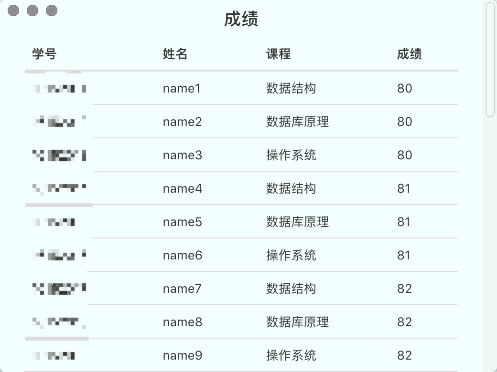

---
tags:
- course
---
<h1 align="center">数据库原理实验</h1>
<!-- TOC -->

- [实验一：SQL定义功能、数据插入](#实验一sql定义功能数据插入)
- [实验二：数据查询](#实验二数据查询)
- [实验三：数据修改、删除](#实验三数据修改删除)
- [实验四：视图操作](#实验四视图操作)
- [实验五：库函数、授权控制](#实验五库函数授权控制)
- [result](#result)
- [综合实验：实现一个小型管理信息系统](#综合实验实现一个小型管理信息系统)
    - [Install from github](#install-from-github)
    - [DevNote](#devnote)

<!-- /TOC -->
## 实验一：SQL定义功能、数据插入
1. 建立教学数据库的三个基本表:
    ```
    S(Sno,Sname,Ssex,Sage,Sdept) 学生(学号,姓名,性别,年龄,系)
    SC(Sno,Cno,Grade) 选课(学号,课程号,成绩)
    C(Cno,Cname,Cpno,Ccredit) 课程v(课程号,课程名,先行课,学分)
    ```
2. DROP TABLE、ALTER TABLE、CREATE INDEX、DROP INDEX 及 INSERT 语句输入数据。

---
**solution**
```sql
-- 1.1
CREATE DATABASE stdb;

CREATE TABLE S
(
    Sno int NOT NULL PRIMARY KEY CHECK(Sno > 0),
    Sname varchar(40) NOT NULL,
    Ssex bool,
    Sage integer(3),
    Sdept integer(2)
);

CREATE TABLE C
(
    Cno int NOT NULL PRIMARY KEY CHECK(Cno > 0),
    Cname varchar(40) NOT NULL,
    Cpno int NOT NULL,
    Ccredit numeric(2,1) NOT NULL
);

CREATE TABLE SC
(
    Sno int,
    Cno int,
    Grade numeric(4,1),
    check(Grade >= 0),
    PRIMARY KEY(Sno,Cno),
    FOREIGN KEY (Cno) REFERENCES C(Cno),
    FOREIGN KEY (Sno) REFERENCES S(Sno)
);

-- 1.2
--- DROP TABLE
DROP TABLE SC;
DROP TABLE S;
DROP TABLE C;

--- ALTER TABLE
CREATE TABLE C;
ALTER TABLE C
ADD Cno int NOT NULL PRIMARY KEY CHECK(Cno > 0);
ALTER TABLE C
ADD Cname varchar(40) NOT NULL;
ALTER TABLE C
ADD Cpno int NOT NULL;
ALTER TABLE C
ADD Ccredit numeric(2,1) NOT NULL;

--- CREATE INDEX
CREATE INDEX CourseIndex ON C(Cno DESC);

--- DROP INDEX
DROP INDEX C.CourseIndex;

--- INSERT
DROP PROCEDURE if EXISTS add_testS_data;
DELIMITER //
    CREATE PROCEDURE add_testS_data()
    BEGIN
        DECLARE num int;
        DECLARE sex char(1);
        DECLARE age integer(3);
        DECLARE dept integer(2);
        SET num=1;
        SET age=20;
        SET dept=16;
        WHILE (num<31) DO
            SET sex=num mod 2;
            INSERT into S values (concat('210016',num),concat('name',num),sex,age,dept);
            SET num=num+1;
        END WHILE;

    END //
DELIMITER ;
call add_testS_data();
SELECT * FROM S;


INSERT into C(Cno,Cname,Ccredit) values (1,'数据结构',3);
INSERT into C(Cno,Cname,Ccredit) values (2,'数据库原理',3);
INSERT into C(Cno,Cname,Ccredit) values (3,'操作系统',3);
SELECT * FROM C;


DROP PROCEDURE if EXISTS add_testSC_data;
DELIMITER //
    CREATE PROCEDURE add_testSC_data()
    BEGIN
        DECLARE i int;
        DECLARE num int;
        SET i=0;
        WHILE (i<10) DO
            SET num=i*3;
            INSERT into SC values (concat('210016',num+1),1,80+i);
            INSERT into SC values (concat('210016',num+2),2,80+i);
            INSERT into SC values (concat('210016',num+3),3,80+i);
            SET i=i+1;
        END WHILE;

    END //
DELIMITER ;
call add_testSC_data();
system echo "update"
INSERT into SC values (21001615,1,90);
INSERT into SC values (21001615,2,90);
UPDATE SC SET Grade=90 WHERE Sno=21001615;
SELECT * FROM SC;
```
---

## 实验二：数据查询
1. 查询选修 1 号课程的学生学号与姓名。
2. 查询选修课程名为数据结构的学生学号与姓名。
3. 查询不选 1 号课程的学生学号与姓名。
4. 查询学习全部课程学生姓名。
5. 查询所有学生除了选修 1 号课程外所有成绩均及格的学生的学号和平均成绩,其结果按平均成绩的降序排列。
6. 查询选修数据库原理成绩第 2 名的学生姓名。
7. 查询所有 3 个学分课程中有 3 门以上(含 3 门)课程获 80 分以上(含 80 分)的学生的姓名。
8. 查询选课门数唯一的学生的学号。
9. SELECT 语句中各种查询条件的实验。

---

**solution**

```sql
-- 2.1
system echo "---------------2.1"
SELECT S.Sno,S.Sname FROM SC,S WHERE SC.Cno=1 AND S.Sno=SC.Sno;

-- 2.2
system echo "---------------2.2"
SELECT S.Sno,S.Sname FROM SC,S,C WHERE C.Cname='数据结构' AND SC.Cno=C.Cno AND S.Sno=SC.Sno;

-- 2.3
system echo "---------------2.3"
SELECT S.Sno,S.Sname FROM SC,S WHERE SC.Cno<>1 AND S.Sno=SC.Sno
GROUP BY S.Sno;

-- 2.4
system echo "---------------2.4"
SELECT S.Sname FROM SC,S WHERE SC.Sno LIKE '%' AND S.Sno=SC.Sno
GROUP BY SC.Sno;

-- 2.5 
system echo "---------------2.5"
DROP TABLE IF EXISTS Ave_G;
CREATE TABLE Ave_G
(
    Sno int FOREIGN KEY REFERENCES S(Sno),
    Ave_Grade numeric(3,1) CHECK(Ave_Grade >= 0)
)
SELECT S.Sno,Ave_Grade FROM SC,S,Ave_G WHERE SC.Cno<>1 AND SC.Grade>60 AND S.Sno=SC.Sno AND Ave_G.Sno=SC.Sno
order by Ave_Grade DESC;

-- 2.6
system echo "---------------2.6"
SELECT S.Sname FROM SC,S,C WHERE C.Cname='数据库原理' AND SC.Cno=C.Cno AND S.Sno=SC.Sno
order by SC.Grade DESC
limit 1,1;

-- 2.7
system echo "---------------2.7"
SELECT S.Sname FROM S WHERE Sno in
(
    SELECT Sno FROM SC,C
        WHERE C.Ccredit=3
        AND SC.Cno=C.Cno
        AND SC.Grade>=80
    group by Sno
    HAVING count(Grade)>=3
);

```

## 实验三：数据修改、删除
1. 把 1 号课程的非空成绩提高 10%。
2. 在 SC 表中删除课程名为数据结构的成绩的元组。
3. 在 S 和 SC 表中删除学号为 95002 的所有数据。

---

**solution**

```sql
-- 3.1
UPDATE SC SET Grade=Grade*1.1 WHERE Grade is NOT NULL AND Cno=1 AND Grade<91;
UPDATE SC SET Grade=100 WHERE Grade is NOT NULL AND Cno=1 AND Grade>=91;

-- 3.2
DELETE Grade
FROM SC
WHERE Sno in
(
    SELECT Sno
    FROM SC
    WHERE Cname='数据结构'
);

-- 3.2
DELETE FROM SC WHERE Sno=95002;
DELETE FROM S WHERE Sno=95002;
```

## 实验四：视图操作
1. 建立男学生的视图,属性包括学号、姓名、选修课程名和成绩。
2. 在男学生视图中查询平均成绩大于 80 分的学生学号与姓名。

---

**solution**

```sql
-- 4.1
CREATE VIEW BoyStudent
AS
SELECT S.Sno,S.Sname,C.Cname,SC.Grade
FROM S,SC,C
WHERE S.Ssex=1
AND SC.Sno=S.Sno
AND C.Cno=SC.Cno;

-- 4.2
SELECT Sno,Sname
FROM BoyStudent
group by Sno
HAVING avg(Grade)>80;
```

## 实验五：库函数、授权控制
1. 计算每个学生有成绩的课程门数、平均成绩。
2. 使用 GRANT 语句,把对基本表 S、SC、C 的使用权限授给其它用户。
3. 实验完成后,撤消建立的基本表和视图。

---

**solution**

```sql
-- 5.1
SELECT Sno,count(Cno),avg(Grade)
FROM SC
WHERE Grade is NOT NULL
GROUP BY Sno;

-- 5.2
create user 'dbtest'@'localhost';
grant all privileges on S to 'dbtest'@'localhost';
show grants for 'dbtest'@'localhost';

-- 5.3
DROP VIEW BoyStudent;
DROP TABLE SC;
DROP TABLE C;
DROP TABLE S;
DROP PROCEDURE add_testS_data;
DROP user dbtest@localhost
-- DROP USER 'root'@'localhost'
```

## result
```sh
mysql> source dbExp.mysql
Query OK, 1 row affected, 1 warning (0.01 sec)

Database changed
Query OK, 0 rows affected (0.11 sec)

Query OK, 0 rows affected (0.01 sec)

Query OK, 0 rows affected (0.02 sec)

Query OK, 0 rows affected (0.00 sec)

Query OK, 0 rows affected (0.00 sec)

Query OK, 1 row affected (0.03 sec)

+-----------+--------+------+------+-------+
| Sno       | Sname  | Ssex | Sage | Sdept |
+-----------+--------+------+------+-------+
|  2100161 | name1  |    1 |   20 |    16 |
|  2100162 | name2  |    0 |   20 |    16 |
|  2100163 | name3  |    1 |   20 |    16 |
|  2100164 | name4  |    0 |   20 |    16 |
|  2100165 | name5  |    1 |   20 |    16 |
|  2100166 | name6  |    0 |   20 |    16 |
|  2100167 | name7  |    1 |   20 |    16 |
|  2100168 | name8  |    0 |   20 |    16 |
|  2100169 | name9  |    1 |   20 |    16 |
| 21001610 | name10 |    0 |   20 |    16 |
| 21001611 | name11 |    1 |   20 |    16 |
| 21001612 | name12 |    0 |   20 |    16 |
| 21001613 | name13 |    1 |   20 |    16 |
| 21001614 | name14 |    0 |   20 |    16 |
| 21001615 | name15 |    1 |   20 |    16 |
| 21001616 | name16 |    0 |   20 |    16 |
| 21001617 | name17 |    1 |   20 |    16 |
| 21001618 | name18 |    0 |   20 |    16 |
| 21001619 | name19 |    1 |   20 |    16 |
| 21001620 | name20 |    0 |   20 |    16 |
| 21001621 | name21 |    1 |   20 |    16 |
| 21001622 | name22 |    0 |   20 |    16 |
| 21001623 | name23 |    1 |   20 |    16 |
| 21001624 | name24 |    0 |   20 |    16 |
| 21001625 | name25 |    1 |   20 |    16 |
| 21001626 | name26 |    0 |   20 |    16 |
| 21001627 | name27 |    1 |   20 |    16 |
| 21001628 | name28 |    0 |   20 |    16 |
| 21001629 | name29 |    1 |   20 |    16 |
| 21001630 | name30 |    0 |   20 |    16 |
+-----------+--------+------+------+-------+
30 rows in set (0.00 sec)

Query OK, 1 row affected (0.01 sec)

Query OK, 1 row affected (0.00 sec)

Query OK, 1 row affected (0.00 sec)

+-----+-----------------+------+---------+
| Cno | Cname           | Cpno | Ccredit |
+-----+-----------------+------+---------+
|   1 | 数据结构        | NULL |     3.0 |
|   2 | 数据库原理      | NULL |     3.0 |
|   3 | 操作系统        | NULL |     3.0 |
+-----+-----------------+------+---------+
3 rows in set (0.00 sec)

Query OK, 0 rows affected (0.00 sec)

Query OK, 0 rows affected (0.00 sec)

Query OK, 1 row affected (0.03 sec)

update
Query OK, 1 row affected (0.00 sec)

Query OK, 1 row affected (0.00 sec)

Query OK, 1 row affected (0.01 sec)
Rows matched: 3  Changed: 1  Warnings: 0

Query OK, 1 row affected (0.00 sec)
Rows matched: 1  Changed: 1  Warnings: 0

+-----------+-----+-------+
| Sno       | Cno | Grade |
+-----------+-----+-------+
|  2100161 |   1 |  80.0 |
|  2100162 |   2 |  80.0 |
|  2100163 |   3 |  80.0 |
|  2100164 |   1 |  81.0 |
|  2100165 |   2 |  81.0 |
|  2100166 |   3 |  81.0 |
|  2100167 |   1 |  82.0 |
|  2100168 |   2 |  82.0 |
|  2100169 |   3 |  82.0 |
| 21001610 |   1 |  83.0 |
| 21001611 |   2 |  83.0 |
| 21001612 |   3 |  83.0 |
| 21001613 |   1 |  84.0 |
| 21001614 |   2 |  84.0 |
| 21001615 |   1 |  90.0 |
| 21001615 |   2 |  90.0 |
| 21001615 |   3 |  90.0 |
| 21001616 |   1 |  85.0 |
| 21001617 |   2 |  85.0 |
| 21001618 |   3 |  85.0 |
| 21001619 |   1 |  86.0 |
| 21001620 |   2 |  86.0 |
| 21001621 |   3 |  86.0 |
| 21001622 |   1 |  87.0 |
| 21001623 |   2 |  87.0 |
| 21001624 |   3 |  87.0 |
| 21001625 |   1 |  88.0 |
| 21001626 |   2 |  88.0 |
| 21001627 |   3 |  88.0 |
| 21001628 |   1 |  89.0 |
| 21001629 |   2 |  89.0 |
| 21001630 |   3 |  89.0 |
+-----------+-----+-------+
32 rows in set (0.00 sec)

---------------2.1
+-----------+-----------+
| Sno       | Sname     |
+-----------+-----------+
|  2100161 | name1     |
|  2100164 | name4     |
|  2100167 | name7     |
| 21001610 | name10    |
| 21001613 | name13    |
| 21001615 | name15    |
| 21001616 | name16    |
| 21001619 | name19    |
| 21001622 | name22    |
| 21001625 | name25    |
| 21001628 | name28    |
+-----------+-----------+
11 rows in set (0.00 sec)

---------------2.2
+-----------+-----------+
| Sno       | Sname     |
+-----------+-----------+
|  2100161 | name1     |
|  2100164 | name4     |
|  2100167 | name7     |
| 21001610 | name10    |
| 21001613 | name13    |
| 21001615 | name15    |
| 21001616 | name16    |
| 21001619 | name19    |
| 21001622 | name22    |
| 21001625 | name25    |
| 21001628 | name28    |
+-----------+-----------+
11 rows in set (0.00 sec)

---------------2.3
+-----------+-----------+
| Sno       | Sname     |
+-----------+-----------+
|  2100162 | name2     |
|  2100165 | name5     |
|  2100168 | name8     |
| 21001611 | name11    |
| 21001614 | name14    |
| 21001615 | name15    |
| 21001617 | name17    |
| 21001620 | name20    |
| 21001623 | name23    |
| 21001626 | name26    |
| 21001629 | name29    |
|  2100163 | name3     |
|  2100166 | name6     |
|  2100169 | name9     |
| 21001612 | name12    |
| 21001618 | name18    |
| 21001621 | name21    |
| 21001624 | name24    |
| 21001627 | name27    |
| 21001630 | name30    |
+-----------+-----------+
20 rows in set (0.00 sec)

---------------2.4
+-----------+
| Sname     |
+-----------+
| name1     |
| name2     |
| name3     |
| name4     |
| name5     |
| name6     |
| name7     |
| name8     |
| name9     |
| name10    |
| name11    |
| name12    |
| name13    |
| name14    |
| name15    |
| name16    |
| name17    |
| name18    |
| name19    |
| name20    |
| name21    |
| name22    |
| name23    |
| name24    |
| name25    |
| name26    |
| name27    |
| name28    |
| name29    |
| name30    |
+-----------+
30 rows in set (0.00 sec)

---------------2.6
+--------+
| Sname  |
+--------+
| name29 |
+--------+
1 row in set (0.00 sec)

---------------2.7
+-----------+
| Sname     |
+-----------+
| name15    |
+-----------+
1 row in set (0.00 sec)

---------------4.1
Query OK, 0 rows affected (0.02 sec)

---------------4.2
+-----------+-----------+
| Sno       | Sname     |
+-----------+-----------+
|  2100167 | name7     |
| 21001613 | name13    |
| 21001615 | name15    |
| 21001619 | name19    |
| 21001625 | name25    |
|  2100165 | name5     |
| 21001611 | name11    |
| 21001617 | name17    |
| 21001623 | name23    |
| 21001629 | name29    |
|  2100169 | name9     |
| 21001621 | name21    |
| 21001627 | name27    |
+-----------+-----------+
13 rows in set (0.00 sec)

---------------5.1
+-----------+------------+------------+
| Sno       | count(Cno) | avg(Grade) |
+-----------+------------+------------+
|  2100161 |          1 |   80.00000 |
|  2100162 |          1 |   80.00000 |
|  2100163 |          1 |   80.00000 |
|  2100164 |          1 |   81.00000 |
|  2100165 |          1 |   81.00000 |
|  2100166 |          1 |   81.00000 |
|  2100167 |          1 |   82.00000 |
|  2100168 |          1 |   82.00000 |
|  2100169 |          1 |   82.00000 |
| 21001610 |          1 |   83.00000 |
| 21001611 |          1 |   83.00000 |
| 21001612 |          1 |   83.00000 |
| 21001613 |          1 |   84.00000 |
| 21001614 |          1 |   84.00000 |
| 21001615 |          3 |   90.00000 |
| 21001616 |          1 |   85.00000 |
| 21001617 |          1 |   85.00000 |
| 21001618 |          1 |   85.00000 |
| 21001619 |          1 |   86.00000 |
| 21001620 |          1 |   86.00000 |
| 21001621 |          1 |   86.00000 |
| 21001622 |          1 |   87.00000 |
| 21001623 |          1 |   87.00000 |
| 21001624 |          1 |   87.00000 |
| 21001625 |          1 |   88.00000 |
| 21001626 |          1 |   88.00000 |
| 21001627 |          1 |   88.00000 |
| 21001628 |          1 |   89.00000 |
| 21001629 |          1 |   89.00000 |
| 21001630 |          1 |   89.00000 |
+-----------+------------+------------+
30 rows in set (0.01 sec)

---------------5.2
Query OK, 0 rows affected (0.00 sec)

Query OK, 0 rows affected (0.00 sec)

+------------------------------------------------------------+
| Grants for dbtest@localhost                                |
+------------------------------------------------------------+
| GRANT USAGE ON *.* TO `dbtest`@`localhost`                 |
| GRANT ALL PRIVILEGES ON `stdb`.`s` TO `dbtest`@`localhost` |
+------------------------------------------------------------+
2 rows in set (0.00 sec)

---------------5.3
Query OK, 0 rows affected (0.00 sec)

Query OK, 0 rows affected (0.01 sec)

Query OK, 0 rows affected (0.01 sec)

Query OK, 0 rows affected (0.01 sec)

Query OK, 0 rows affected (0.00 sec)

Query OK, 0 rows affected (0.00 sec)

mysql>
```

## 综合实验：实现一个小型管理信息系统
熟练掌握 Visual C++、C#、Qt、Java、PHP 或 Python 等访问数据库的方法, 设计和实现学生通讯录或学生选课或类似的一个小型管理信息系统。要求具有数据的增加、删除、修改和查询的基本功能,并尽可能提供较多的查询功能,用户界面要友好。可选内容:数据库中存放 100 万条记录,测试访问时间;如效率较低,提供优化方案。

---

### Install from github

```sh
# install mysql 8.0.11
# mysql client
# user:root
# password:root123456
git clone https://github.com/DoubleMice/DBExperiment_Electron.git
cd DBExperiment_Electron
mysql -u root -p
password: root123456
mysql source dbExp.mysql
npm install
npm start
```

---

### DevNote
**自定义菜单**
```javascript
import {Menu} from 'electron';
...
...
const menuTemplate = [
    {
        lable : "lable1",
        submenu : [
            {role : "role1"},
            {role : "role2"}
            ...
        ]
    },
    ...
    {
        lable : "lablen",
        submenu : [
            {role : "role1"},
            ...
            {role : "rolen"}
        ]
    }
]

if (process.platform === 'darwin') {
    ...
    //定义osx上的菜单
}

const menu = Menu.buildFromTemplate(menuTemplate);
Menu.setApplicationMenu(menu);
```


**主线程中ipcMain**
index.js 主线程
ipc监听，打开子窗口
```javascript
import { ipcMain } from 'electron';
...
...
const ipc = require('electron').ipcMain;
ipc.on('subwin',function(event,subwin_name){
    let subwin = new BrowserWindow({
      width: 520, 
      height: 390,
      // frame:false,
      titleBarStyle: 'hidden',
      show: false,
      parent: mainWindow, //主窗口
    });
    subwin.loadURL(`file://${__dirname}/subwin/`+subwin_name+`.html`);
    // subwin.webContents.openDevTools();
    subwin.on('ready-to-show', function() {
      subwin.show();
      subwin.focus();
    });
    subwin.on('closed',()=>{subwin = null})

})
```

**子线程ipcRenderer**
./subwin/[operation].js
子线程发送ipc信号至主线程
```javascript
    const submit = document.querySelector("#submit");
    const ipc = require('electron').ipcRenderer;
    console.log(submit);
    submit.onclick=()=>
    {
        var Cno = document.getElementById("Cno").value;
        var Sno = document.getElementById("Sno").value;
        var Grade = document.getElementById("Grade").value;
        var result = ipc.sendSync("submit","addgrade",Sno,Cno,Grade);
        //同步发送ipc信号，阻塞等待ipcMain接受并处理信号
        //result赋值为ipcMain的event.returnValue
    }
```
**Structure**
```sh
DoubleMice@DoubleMice-MacBookPro:~/Documents/课程/数据库课设/DBExperiment_Electron|master⚡
⇒  tree
.
├── LICENSE
├── README.md
├── assets
│   ├── app.icns
│   └── snapshot.png
├── dbExp.mysql
├── package-lock.json
├── package.json
└── src
    ├── dbtest.js
    ├── index.html
    ├── index.js
    ├── style.css
    └── subwin
        ├── addcourse.html
        ├── addgrade.html
        ├── addstudent.html
        ├── deletecourse.html
        ├── deletegrade.html
        ├── deletestudent.html
        ├── findcourse.html
        ├── findgrade.html
        ├── findstudent.html
        ├── updatecourse.html
        ├── updategrade.html
```
**Snopshot**
主界面


查询界面
