---
tags:
- IoT
---

# 物联网安全 ASA防火墙（上）
## 目录

<!-- TOC -->

- [物联网安全 ASA防火墙（上）](#物联网安全-asa防火墙上)
    - [目录](#目录)
    - [（一）简介](#一简介)
        - [思科ASA设备](#思科asa设备)
        - [ASA5505](#asa5505)
        - [cisco vASA](#cisco-vasa)
        - [cisco ASA软件](#cisco-asa软件)
        - [cisco ASA文件系统](#cisco-asa文件系统)
        - [连接ASA设备](#连接asa设备)
    - [（二）固件部分](#二固件部分)
        - [修改固件目的](#修改固件目的)
        - [网络设置如下](#网络设置如下)
        - [环境变量设置](#环境变量设置)
        - [unpack_repack_bin.sh](#unpack_repack_binsh)
        - [固件提取](#固件提取)
        - [固件修改](#固件修改)
        - [bin.py](#binpy)
        - [cpio.sh](#cpiosh)
        - [lina.py](#linapy)
        - [info.sh](#infosh)
        - [info.py](#infopy)
    - [附录](#附录)
        - [一些报错](#一些报错)
        - [问题分析](#问题分析)
        - [如何解决](#如何解决)
    - [参考](#参考)

<!-- /TOC -->

## （一）简介

### 思科ASA设备

思科自适应安全设备 (ASA) 软件是为 Cisco ASA 系列提供强大功能的核心操作系统。它拥有多种外观，为 ASA 设备提供企业级防火墙功能 - 独立式设备(US)、刀片(US)和虚拟。ASA 软件还与其他关键安全技术集成，以提供功能全面的解决方案，满足不断发展的安全需要。
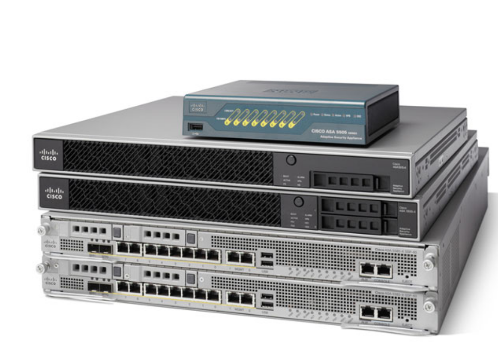

传统的思科ASA硬件
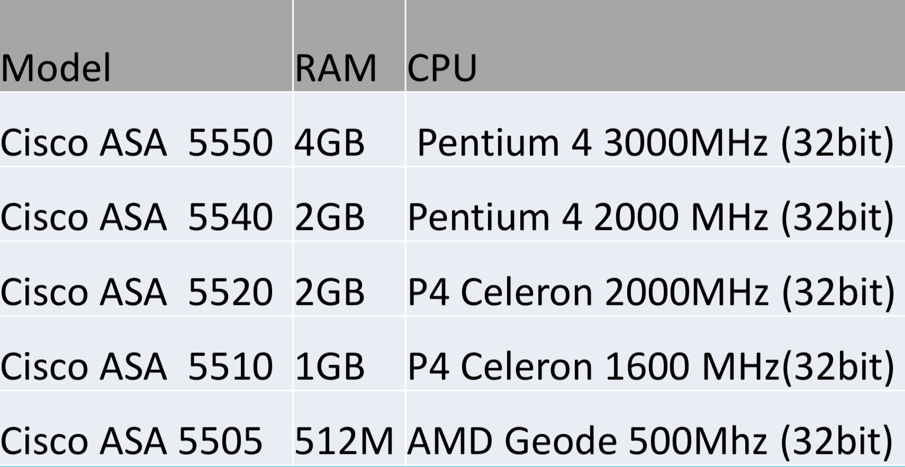

“下一代防火墙”硬件
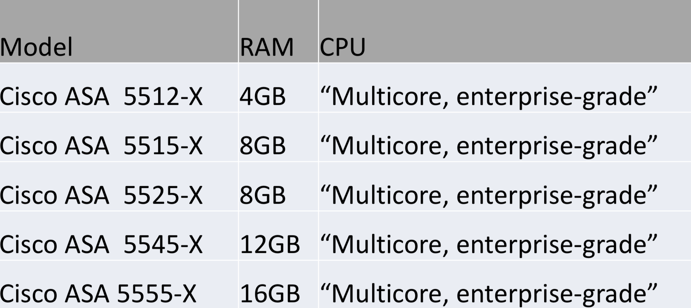

- “黑盒”应用
- 底层硬件为Intel

### ASA5505

特点：

- 便宜
- 支持最新版本固件
- 与其他更高版本的32位ASA设备所用固件相同
- x86 exploit

此型号是安全研究的首选。

### cisco vASA

- 虚拟防火墙（VMware/KVM/GNS3）
- 同样支持最新版本固件
- 与其他更高版本的64位“下一代防火墙”所用固件相同
- x86-64 exploit

### cisco ASA软件

- CLI (cisco IOS)
  - none-exec mode
  - exec mode (enable)
  - config mode (config terminal)
  - 持续性存储，根目录为`disk0:/`，包括`config`、`firmware`、`log`等

- GUI (ASDM)
  - java based
  - 网页端http post图形化执行`exec/config`等命令

所以asa设备上跑的是啥系统呢？
我们可以通过`show kernel process`来初步判断一下
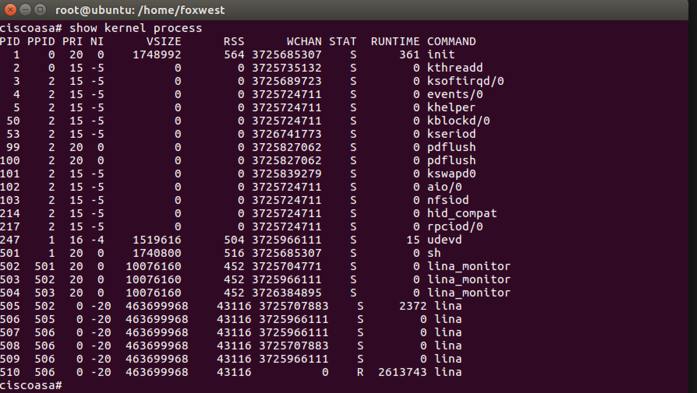

从结果我们可以看出一些unix类系统的影子。

具体用了哪些开源代码可以在思科官网下载`Open Source Used In Cisco ASA`。

但是`lina`、`lina_monitor`又是啥呢？

### cisco ASA文件系统

固件解包之后可以发现asa上跑的是一个linux系统。

- 带busybox的基本linux环境
- `/asa`文件夹中存放思科设备相关的文件
- 设备启动流程：

  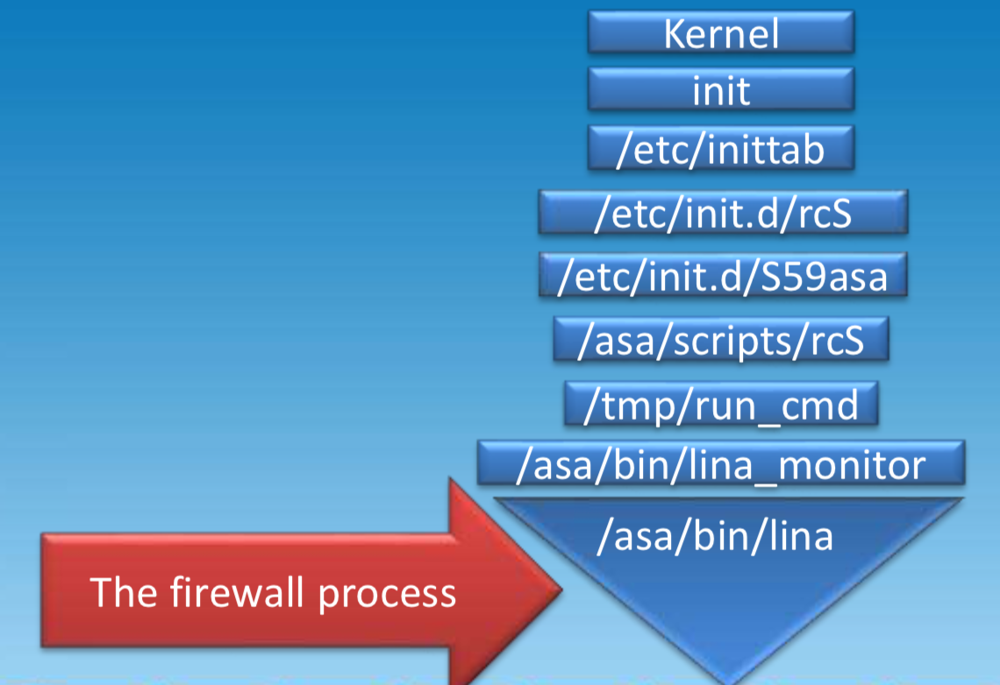

- 从rommon启动固件过程：

  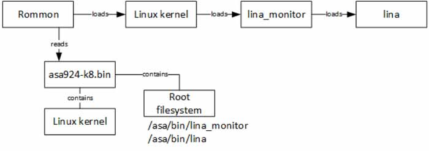


上图中最后启动的`/asa/bin/lina`即真正的防火墙软件
而基本的linux环境：

- no aslr
- 有`/dev/mem`访问权限
- enable module
- 有gdbserver
- 支持ptrace
- 无网络访问权限

只通过`/asa/bin/lina`进行网络交互：

- 用户态PCI驱动
- 处理网络PCI中断
- 处理帧/包

当linux系统需要用到网络功能时，可以通过：

- /asa/scripts
- 模块引用：`LD_PRELOAD=libdsocks.so`

  `libdsocks.so` 可以强制应用程序使用socks代理，在lina中开启socks代理：
  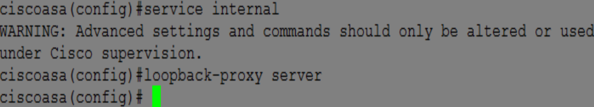
  使得linux shell可以访问网络

### 连接ASA设备

材料

- minicom（win对应超级终端、putty也行）
- asa5505
- aj45转usb线

ubuntu16.04、osx10.14均不需要PL2303串口驱动。
有些情况下如果无法识别aj45转usb则需要另装驱动。

电脑连接串口
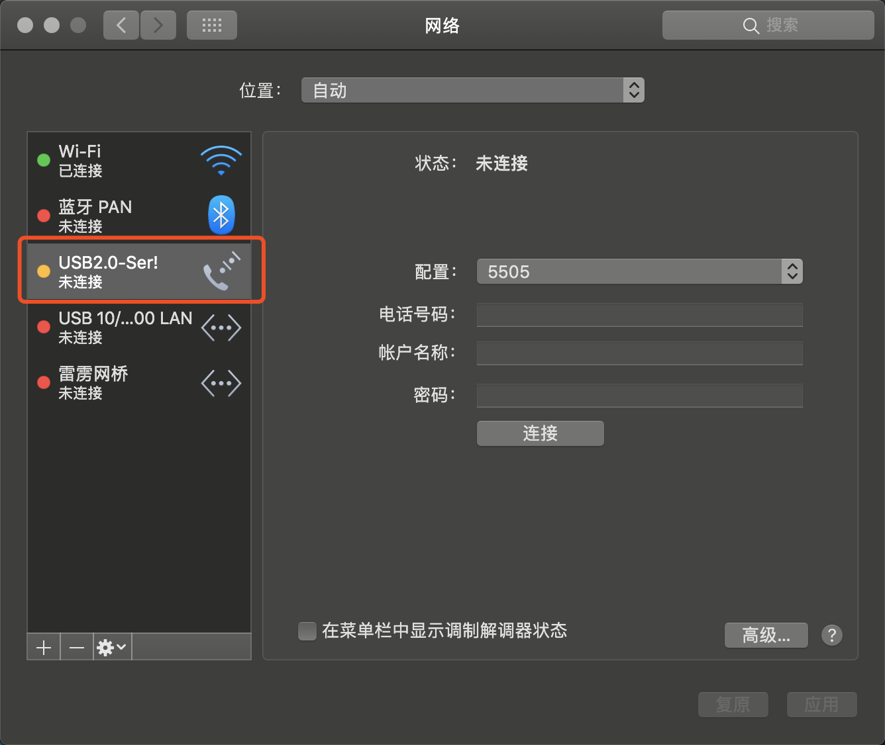

minicom配置
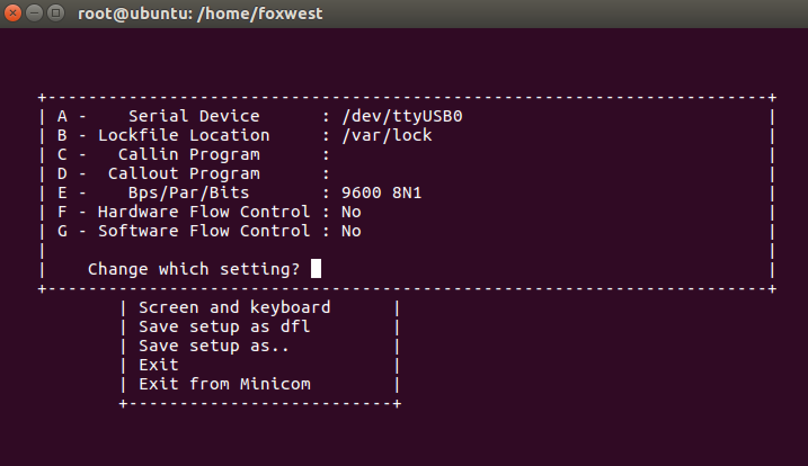

linux对应的串口设备为/dev/ttyUSB0
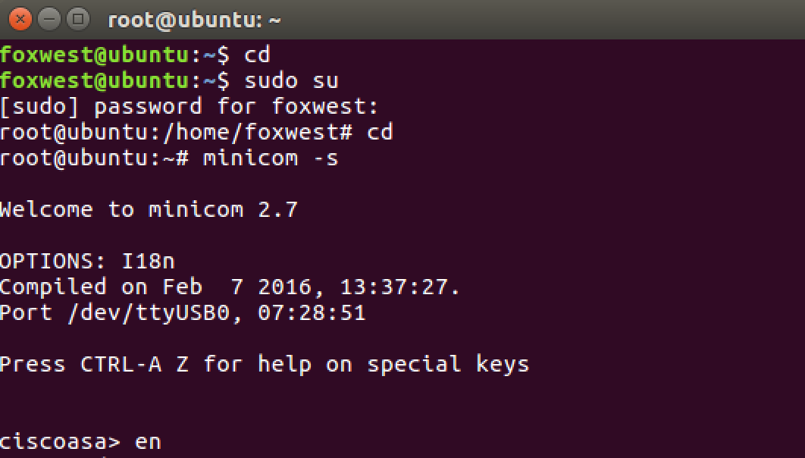

## （二）固件部分

### 修改固件目的

- 防火墙开机时即支持gdb
- 关闭ASLR
- 真机调试时注入linux debug shell来支持gdb中的CTRL+C
- 获得固件root权限
- ...

  ps:使用时，已知有问题的脚本有`unpack_repack_*.sh`，魔改之后可用。

### 网络设置如下

``` text
inside：192.168.1.1
outside：192.168.100.1

ASA firewall                 192.168.100.1
PC1（调试机/OSX10.14）         192.168.100.11
PC2（上传机/Fedora in vmware） 192.168.100.12
PC3（控制机/ubuntu in vmware） 192.168.100.13 同时连接了console口
```

### 环境变量设置

`asafw`和`asadbg`中均有相同的`env.sh`文件。

- 设置工作目录：
  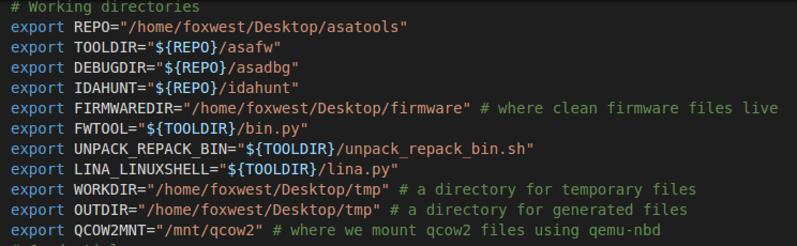

- 设置ip、ida路径
  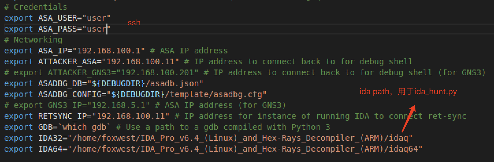

### unpack_repack_bin.sh

- usage

  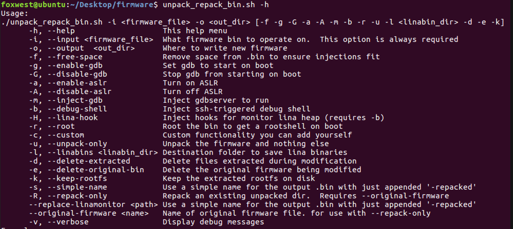

- 一些例子：

  ```sh
  # 提取，释放空闲空间、开机允许gdb调试、注入gdbserver，重新打包到指定目录
  ./unpack_repack_bin.sh -i /home/user/firmware -o /home/user/firmware_repacked --free-space\
    --enable-gdb --inject-gdb
  # 提取，释放空闲空间、开机允许gdb调试、注入gdbserver，重新打包
  ./unpack_repack_bin.sh -i /home/user/firmware/asa961-smp-k8.bin -f -g -m
  # 提取lina到指定目录
  ./unpack_repack_bin.sh -u -i /home/user/firmware -l /home/user/linabins
  # 打包、释放空闲空间、修改lina绕过校验
  ./unpack_repack_bin.sh --repack-only -i _asa924-smp-k8.bin.extracted --output-bin\ 
  asa924-smp-k8-repacked.bin --original-firmware /home/user/firmware/asa924-smp-k8.bin\
    --free-space --replace-linamonitor /home/user/firmware/lina_monitor_patched
  # 提取，释放空闲空间、开机gdb调试、注入debug shell、添加linahook
  ./unpack_repack_bin.sh -i asa924-smp-k8.bin -f -g -b -H hat
  ```

### 固件提取

- 参数`-u`只提取固件文件，`-k`只保留rootfs。

  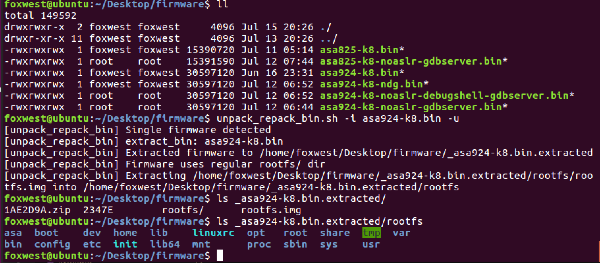

### 固件修改

- 开机gdb调试、注入debug shell、禁用aslr
  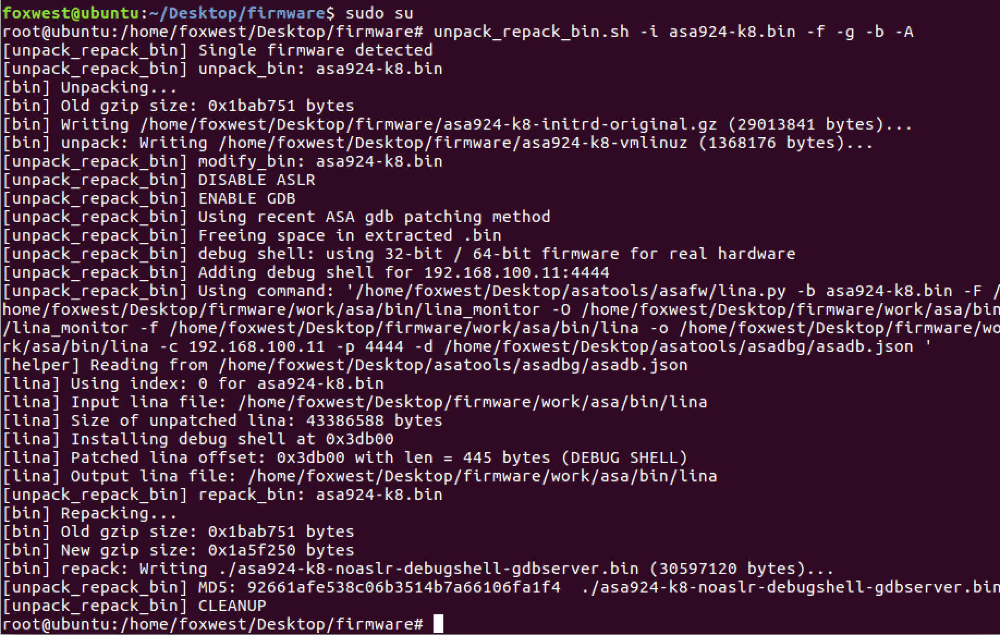

### bin.py

- help

  ```sh
  $ bin.py -h
  usage: bin.py [-h] [-f FIRMWARE_FILE] [-g GZIP_FILE] [-u] [-r] [-t] [-T]
                [-o OUTPUTFILE]

  optional arguments:
    -h, --help            show this help message and exit
    -f FIRMWARE_FILE, --firmware-file FIRMWARE_FILE
    -g GZIP_FILE, --gzip-file GZIP_FILE
    -u, --unpack
    -r, --repack
    -t, --root
    -T, --unroot
    -o OUTPUTFILE, --output-file OUTPUTFILE
  ```

- 提取linux内核

  ```sh
  $ bin.py -f asa924-k8.bin -u
  [bin] Unpacking...
  [bin] Writing asa924-k8-initrd-original.gz (29013841 bytes)...
  [bin] unpack: Writing asa924-k8-vmlinuz (1368176 bytes)...
  $ file asa924-k8-*
  asa924-k8-initrd-original.gz:       gzip compressed data, was "rootfs.img", from Unix, last modified: Wed Jul 15 06:19:52 2015
  asa924-k8-vmlinuz:                  x86 boot sector
  ```

- root

  ```sh
  $ bin.py -f asa924-k8.bin -t
  [bin] root: Writing asa924-k8-rooted.bin (30597120 bytes)...
  ```

### cpio.sh

rootfs.img修改脚本

- help

  ```sh
  $ cpio.sh -h
  Unknown option
  -c  Create cpio image
  -d  Directory to turn into cpio image
  -e  Extract cpio image
  -o  Output file
  Examples:
  Create ./cpio.sh -c -d rootfs -o rootfs.img
  Extract ./cpio.sh -e -i rootfs.img
  ```

- 解压rootfs.img

  ```sh
  $ cpio.sh -e -i asa924-k8-initrd-original -d rootfs_924
  $ ls rootfs_924/
  asa  bin  boot  config  dev  etc  home  init  lib  lib64  linuxrc  mnt  opt  proc  root  sbin  share  sys  tmp  usr  var
  ```

### lina.py

用于固件patch

- help

  ```sh
  $ lina.py -h
  usage: lina.py [-h] [-c CBHOST] [-p CBPORT] [--log-port CBLOGPORT]
                [-i TARGET_INDEX] [-f LINA_FILE] [-b BIN_NAME]
                [-o LINA_FILE_OUT] [--hook] [-v] [-d TARGET_FILE]

  optional arguments:
    -h, --help            show this help message and exit
    -c CBHOST             Attacker or debugger IP addr for reverse shell
    -p CBPORT             Attacker or debugger port for reverse shell
    --log-port CBLOGPORT  Port for sending hook logs
    -i TARGET_INDEX       Index of the target (use -l to list them all)
    -f LINA_FILE          Input lina file
    -b BIN_NAME           Input bin name
    -o LINA_FILE_OUT      Output lina file
    --hook                Insert lina hooks
    -v                    Display more info
    -d TARGET_FILE        JSON db name
  ```

- 添加debug shell

  ```sh
  $ lina.py -c 192.168.1.1 -p 5555 -f _asa924-k8.bin.extracted/rootfs/asa/bin/lina -b\
  asa924-k8.bin -o lina_patched -d /path/to/asadbg/asadb.json 
  [lina] WARN: No index specified. Will guess based on lina path...
  [lina] Using index: 0 for asa924-k8.bin
  [lina] Input file: _asa924-k8.bin.extracted/rootfs/asa/bin/lina
  [lina] Size of clean lina: 43386588 bytes
  [lina] Patching lina offset: 0x3db00 with len = 445 bytes
  [lina] Output file: lina_patched
  ```

### info.sh

- help

  ```sh
  $ info.sh -h
  Display/save mitigations and additional info for all firmware in the current folder
  Usage: info.sh [--save-result --db-name <json_db>]
  ```

- 从已解压固件中获取信息并建立数据库
  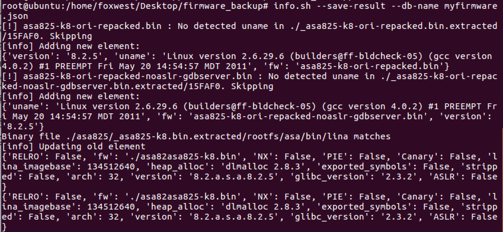

### info.py

操作固件信息数据库

- help

  ```sh
  $ info.py -h
  usage: info.py [-h] [-l] [-u UPDATE_INFO] [-i BIN_NAME] [-v VERBOSE]
                [-d DBNAME]

  optional arguments:
    -h, --help      show this help message and exit
    -l              List migitations in all firmware versions
    -u UPDATE_INFO  Output from info.sh to update db
    -i BIN_NAME     firmware bin name to update or display
    -v VERBOSE      display more info
    -d DBNAME       json database name to read/list info from
  ```

- 显示所有已提取固件信息
  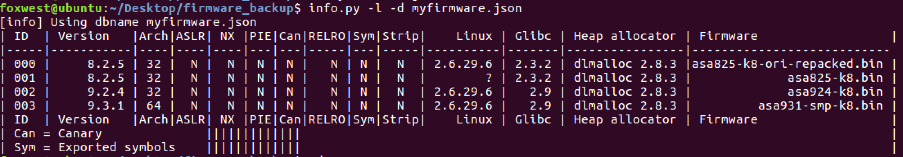

## 附录

### 一些报错

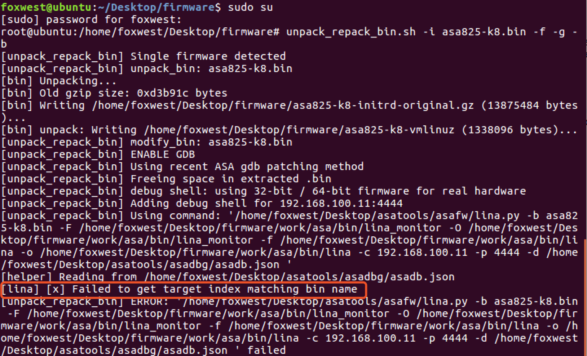

### 问题分析

添加`debug shell`时未能从已有数据库中找到符号信息：
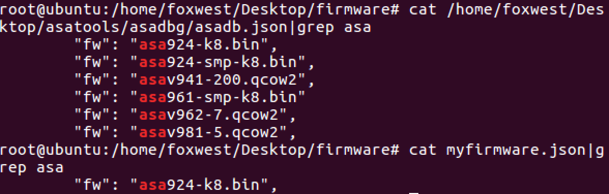
由于此时固件版本是8.2.5，`asadb.json`中没有`lina_imagebase`,`socks_proxy_server_start`,`clock_interval`,`aaa_admin_authenticate`等用于固件修改所需的信息。

### 如何解决

- 手动添加符号
  - 将`ida`路径添加到环境变量

  ```sh
  export IDA32="/Applications/IDA_Pro_7.0/ida.app/Contents/MacOS/ida"
  export IDA64="/Applications/IDA_Pro_7.0/ida64.app/Contents/MacOS/ida64"
  if [ ! -z "${PATH##*${IDA32}*}" ]; then
      PATH=${PATH}:${IDA32}
  fi
  if [ ! -z "${PATH##*${IDA64}*}" ]; then
      PATH=${PATH}:${IDA64}
  fi
  ```

- 添加一些必要文件，来满足`ida_hunt.py`所需依赖

  ```sh
  doublemice@DoubleMice-MBP:~/asatools/asadbg|21ccd9c⚡ 
  ⇒  cp ../idahunt/filelock.py .
  ⇒  wget https://raw.githubusercontent.com/idapython/src/master/python/idc.py
  ```

- idapython生成`.idb`文件
  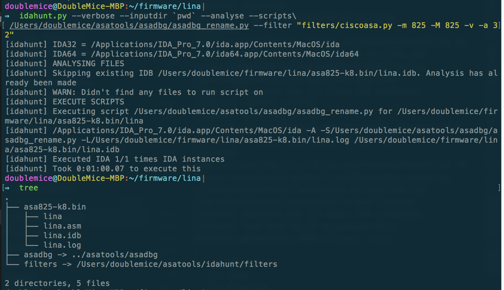

- 提取符号信息导出为`json`文件
  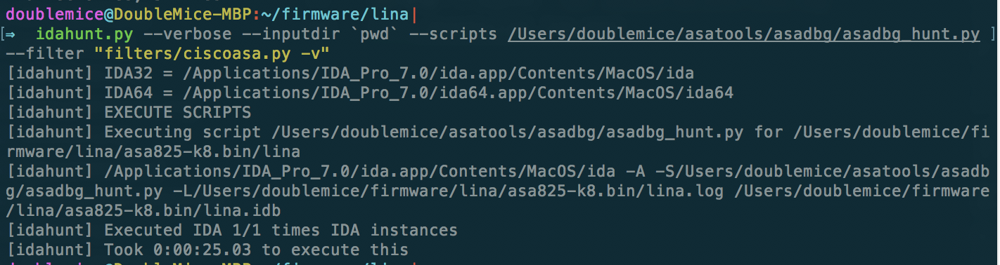

- 我们来看一下log文件：`cat asa825-k8.bin/lina.log`
  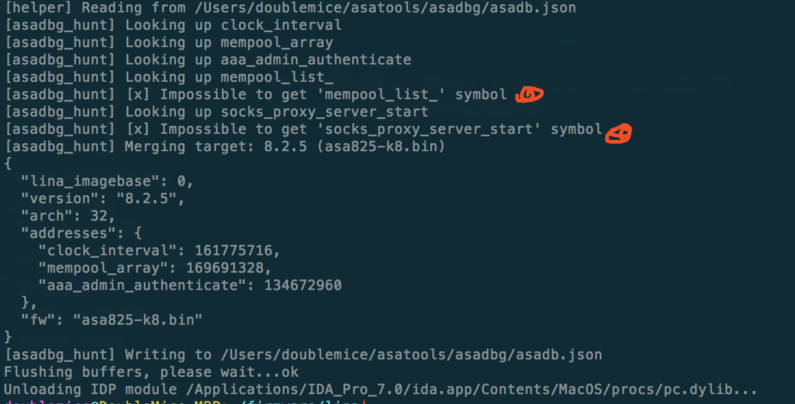
有些固件会因为没有相应功能而无法找到对应的符号，此时我们用`unpack_repack_bin.sh`的时候有些参数将会无效。
ps:`asa924-k8.bin`中均能找到这些符号，建议将此版本固件作调试。

## 参考

- [nccgroup:asatools](https://github.com/nccgroup/asatools)
- [nccgroup:cisco-asa-series-part](https://www.nccgroup.trust/uk/about-us/newsroom-and-events/blogs/2017/september/cisco-asa-series-part-one-intro-to-the-cisco-asa/)
- [Breaking Bricks SEC-T15](https://github.com/alec-stuart/BreakingBricks)
- [cisco:asa-5500-series](https://www.cisco.com/c/en/us/support/security/asa-5500-series-next-generation-firewalls/tsd-products-support-series-home.html)

（三、四部分为防火墙网络配置、防火墙gdbserver调试）