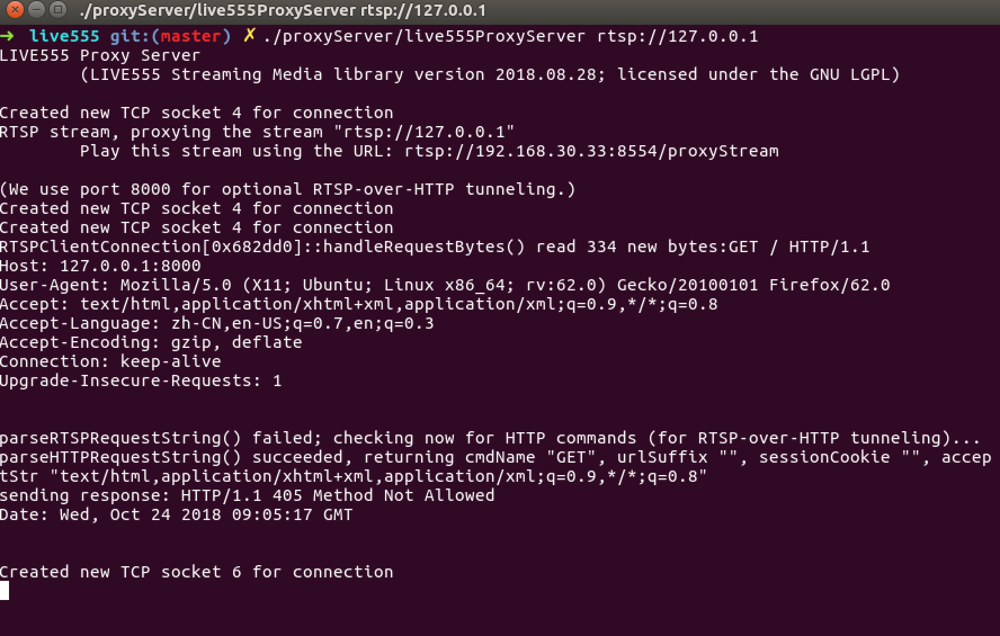
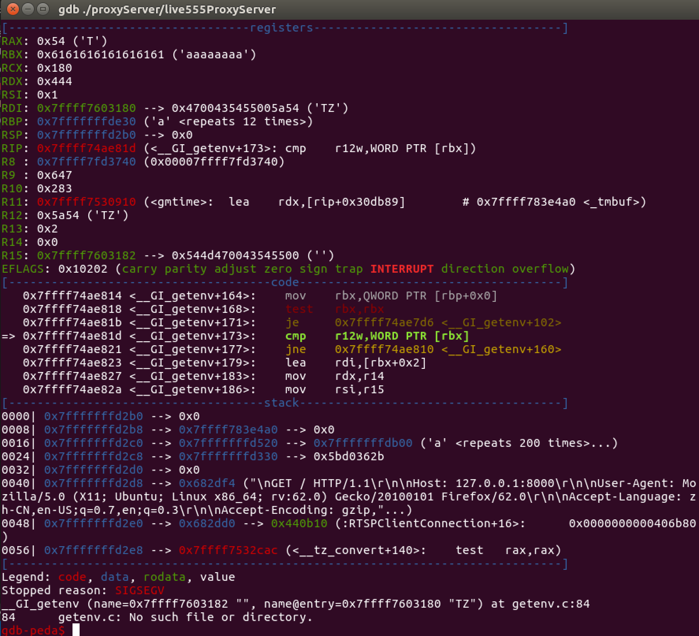

---
tags:
- pwn 
- binary
- cve复现

# draft
---

## 漏洞描述
LIVE555 RTSP server在对http请求解包时，默认`x-sessioncookie`和`Accept`请求头最多只出现一次，攻击者可通过构造包含多个特定请求头的http请求触发栈溢出。这两个特定请求头用于标识是否为`RTSP-over-http tunnel`。

## 漏洞成因

漏洞代码位于`lookForHeader`函数。该函数调用链如下：
```
//liveMedia/RTSPServer.cpp #607
RTSPServer::RTSPClientConnection::handleRequestBytes(int)
->
//liveMedia/RTSPServer.cpp #825
RTSPServer::RTSPClientConnection::parseHTTPRequestString
(char*, unsigned int, char*, unsigned int, char*, unsigned int, char*, unsigned int)
->
//liveMedia/RTSPServer.cpp #478,479
lookForHeader()
```

一些关键数据结构定义及关键函数调用如下：
```cpp
//liveMedia/RTSPServer.cpp #478附近
    lookForHeader("x-sessioncookie", &reqStr[i], reqStrSize-i, sessionCookie, sessionCookieMaxSize);
    lookForHeader("Accept", &reqStr[i], reqStrSize-i, acceptStr, acceptStrMaxSize);

//liveMedia/RTSPServer.cpp #825附近
    ...
    // The request was not (valid) RTSP, but check for a special case:
    // HTTP commands (for setting up RTSP-over-HTTP tunneling):
->  char sessionCookie[RTSP_PARAM_STRING_MAX];  
    //RTSP_PARAM_STRING_MAX 200
->  char acceptStr[RTSP_PARAM_STRING_MAX];      
    //RTSP_PARAM_STRING_MAX 200
    *fLastCRLF = '\0'; // temporarily, for parsing
    parseSucceeded = parseHTTPRequestString(cmdName, sizeof cmdName,
        urlSuffix, sizeof urlPreSuffix,
        sessionCookie, sizeof sessionCookie,
        acceptStr, sizeof acceptStr);
    *fLastCRLF = '\r';
```
数组`sessionCookie`和`acceptStr`最大长度为200字节。


```cpp
static void lookForHeader(char const* headerName, 
                            char const* source, 
                            unsigned sourceLen, 
                            char* resultStr, 
                            unsigned resultMaxSize) {
    resultStr[0] = '\0';  // by default, return an empty string
    unsigned headerNameLen = strlen(headerName);
①---for (int i = 0; i < (int)(sourceLen-headerNameLen); ++i) {
②------if (strncmp(&source[i], headerName, headerNameLen) == 0 && source[i+headerNameLen] == ':') {
        // We found the header.  Skip over any whitespace, then copy the rest of the line to "resultStr":
        for (i += headerNameLen+1; i < (int)sourceLen && (source[i] == ' ' || source[i] == '\t'); ++i) {}
③----------for (unsigned j = i; j < sourceLen; ++j) {
                if (source[j] == '\r' || source[j] == '\n') {
                    // We've found the end of the line.  Copy it to the result (if it will fit):
                    if (j-i+1 > resultMaxSize) break;
                    char const* resultSource = &source[i];
                    char const* resultSourceEnd = &source[j];
                    while (resultSource < resultSourceEnd) *resultStr++ = *resultSource++;
                    *resultStr = '\0';
④ -----------------break;
                }
            }
        }
    }
}
```


②处代码会寻找http请求中的特定请求头，如果结果为真则拷贝空白字符之后的内容到`resultStr`数组。
假设特定请求头出现次数只有一次，那么正常情况下会在④处退出拷贝循环，但仍在①处的循环中，直到`i = (int)(sourceLen-headerNameLen)`才结束循环。
问题就出在④处，完成首次拷贝后没有结束该函数执行。
攻击者可通过构造包含多个特定请求头的http请求，不断往`resultStr`拷贝数据从而导致溢出。


## 漏洞复现

### 获取包含漏洞的代码版本

提前fork了代码镜像仓库中的0.92版本作为存档
```
git clone https://github.com/DoubleMice/live555.git
```


### 编译liveMedia server

* 开启DEBUG
    ```
    // RTSPCommon.hh

    #ifndef DEBUG
    #define DEBUG
    #endif
    ```

* 生成linux下的makefile
    `./genMakefile linux`
* 编译
    `make -j4`

### 开启RTSP-over-http

* 用代理开启RTSP-over-http
    `./proxyServer/live555ProxyServer rtsp://127.0.0.1`

* 查看是否成功开启
    * 浏览器访问`192.168.30.33:8000`，其中ip为server ip
    * 发现服务端输出的调试信息如下，已成功开启rtsp-over-http
        
    


### 触发崩溃



### poc

[cve-2018-4013.py](https://github.com/DoubleMice/cve-2018-4013/blob/master/cve-2018-4013.py)


## reference
[TALOS-2018-0684 ||  Cisco Talos Intelligence Group - Comprehensive Threat Intelligence](https://talosintelligence.com/vulnerability_reports/TALOS-2018-0684)

<div align="center">
DoubleMice@<a href="http://www.seclover.com">SecloverLab</a>
</div>