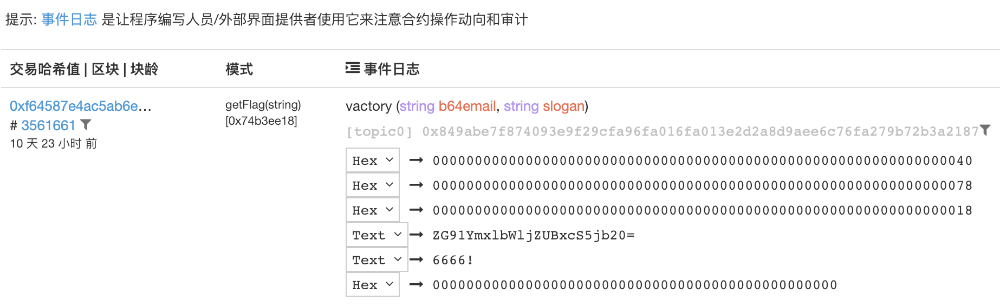

---
tags:
- contract
- blockchain
# draft
---


> 半个月前给校赛nuaactf出了两道题，原本是两道逆向，想了一下（关键是菜，反正有耗子gg的逆向）就蹭波智能合约热度现学了下solidity，出了一个简单的合约逆向、一个整数下溢。就简要写写出题过程好了。


## 攻击面


图片来自slowmist

[推荐阅读：以太坊智能合约安全入门](http://rickgray.me/2018/05/17/ethereum-smart-contracts-vulnerabilities-review/)


## ctf智能合约出题指南
有如下步骤
* solidity语言的智能合约编写，基础教程：
	* https://remix.ethereum.org 在线编程环境
	* https://cryptozombies.io/zh/  solidity教程
* 智能合约部署：
	* eos测试链rinkeby、ropsten、kovan等，获取测试币 -> 在remix环境中选择对应网络并部署
		* 获取测试币
			* rinkeby测试币： [Rinkeby: Authenticated Faucet](https://faucet.rinkeby.io/)
			* ropsten测试币： [Test Ether Faucet](https://faucet.metamask.io/)
			* kovan测试币：[kovan](https://faucet.kovan.network/)
		* 浏览器插件metamask，选择某个网络
		* remix在线IDE中选择 injected web3：
		* 选择对应合约并部署：

* 合约中定义一个event，达到某个条件后触发：
    * 定义事件
        ```
        ...
        event victory(string b64email,string slogan);
        ...
        ```
    * 在合约中触发事件
        ```
        contract getFlag {
            function getFlag(string b64email) {
                // some condiction
                require(...,"error msg");
                require(...);
                ...
                // trigger here
                emit victory(b64email, "6666!");
                ...
            }
        }
        ```
    * 合约中定义事件后，如果合约被部署到链上，事件触发时将会被记录，如上面的`victory(b64email,"6666!")`,当`getFlag()`被调用且满足条件并触发`victory`事件时，记录会写入链中：

* 监听区块链事件
	* 需要一个发送flag的邮箱、[Infura - Scalable Blockchain Infrastructure](https://infura.io/)提供的监听api
		* 注册infura账户 -> 创建project -> 将合约地址添加到infura -> 选择对应网络的api地址
	* 通过eos的接口查看事件生成，这样获取到的事件列表为最新写入的事件：
    * 事件过滤，其中`topic0`为触发`victory`时事件截图图中的`topic0`：
        ```py
        def flag_event():
            flag_logs = w3.eth.getLogs({
                # event filter
                "address":contract_address,
                "topic0":contract_topic0
            })
        ```
	* 循环监听，发送flag：
        ```py
        def event():
            flag_logs = w3.eth.getLogs({
                    "address":contract_address,
                    "topic0":contract_topic0
                })
            if flag_logs is not []:
                for flag_log in flag_logs:
                    data = flag_log["data"][2:]
                    length = int(data[64*2:64*3].replace('00', ''),16)
                    data = data[64*3:][:length*2]
                    b64email = binascii.unhexlify(data).decode('utf-8')
                    try:
                        email = base64.b64decode(b64email).decode('utf-8')
                        sendflag(email)
                    except:
                        errmsg = time.strftime("%Y-%m-%d %H:%M:%S", time.localtime())+":decode or send to b64 - {} fail".format(b64email)
                        os.system("echo " + errmsg + ">> /tmp/variant_of_cat_error.log")
                        print(errmsg)
        while(True):
            event()
            time.sleep(15)
        ```

## 其他

* 代码见：[nuaactf2018-contract](https://github.com/DoubleMice/nuaactf2018_contract)

* 参考：[LoRexxar-HCTF2018_bet2loss](https://github.com/LoRexxar/HCTF2018_bet2loss/blob/master/web/views.py)