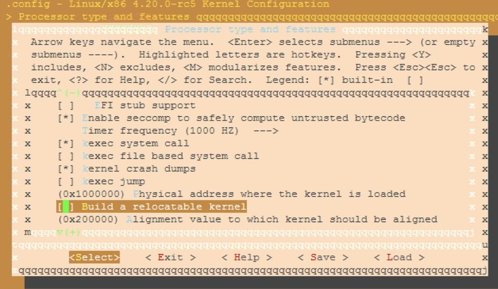
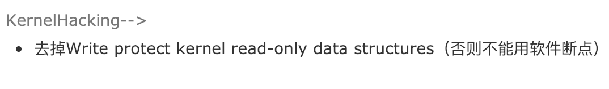
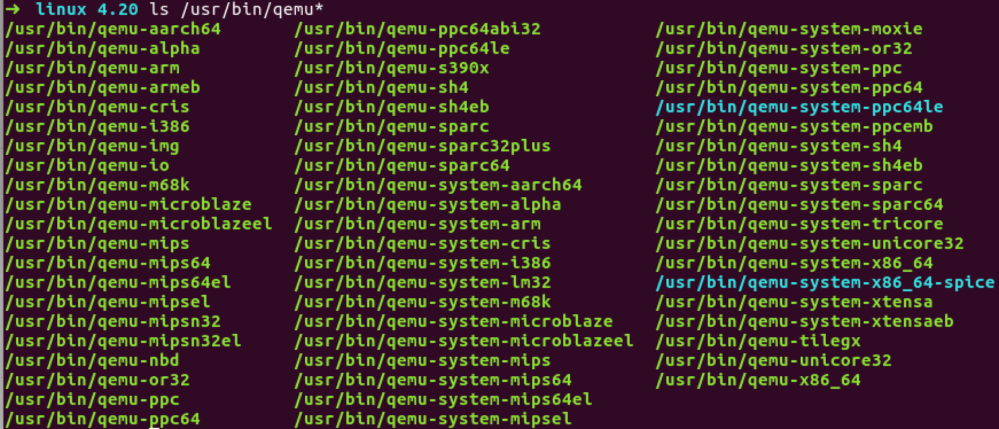
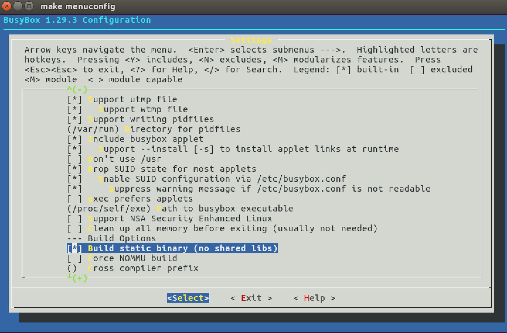
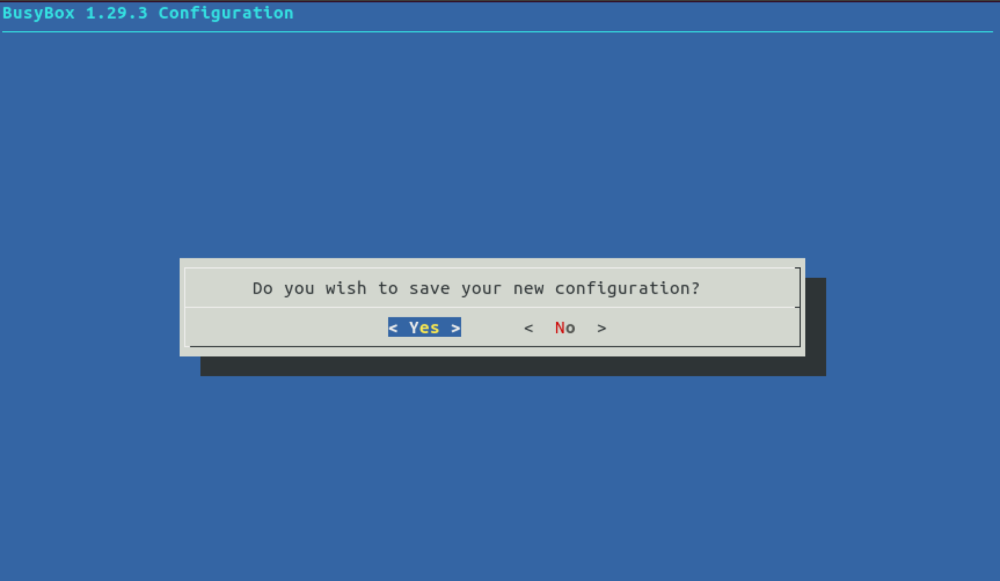
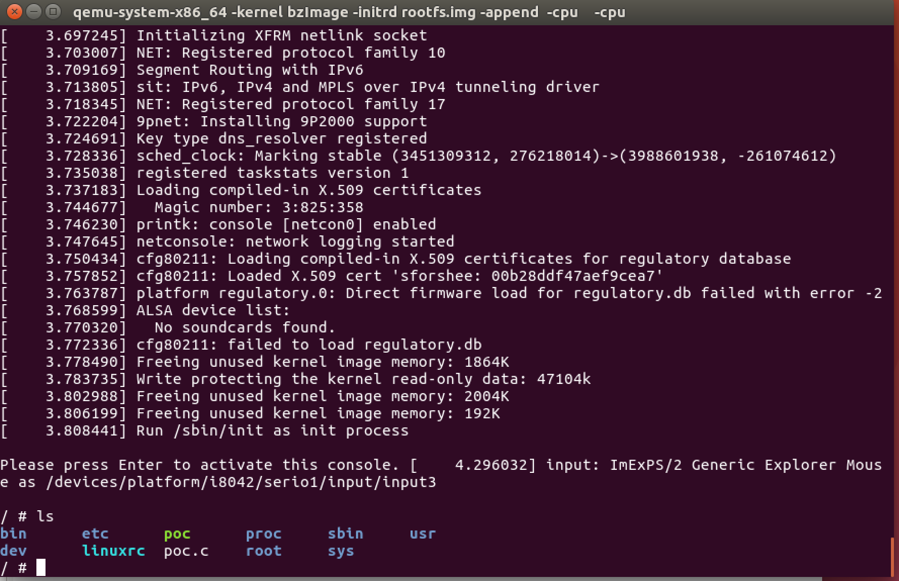
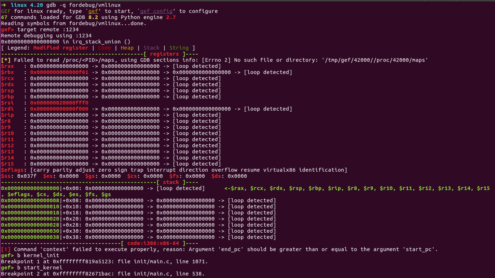
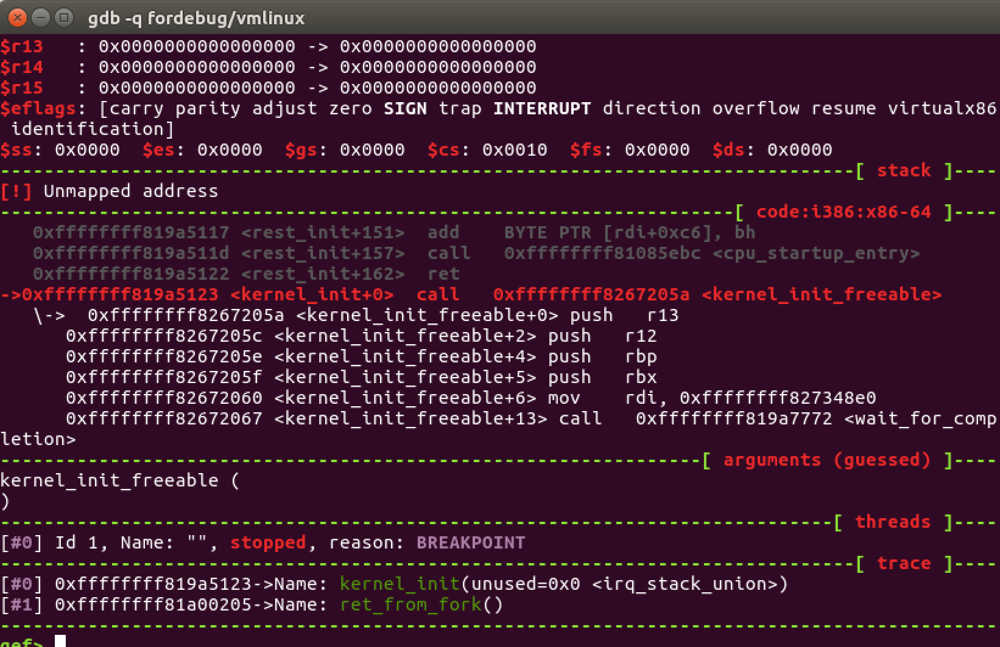

# linux 内核调试环境搭建
> 目标：用qemu启动编译的指定版本的linux内核，启动的时候等待gdb远程调试连接，gdb加载内核符号文件vmlinux对内核进行调试。  


## 编译linux内核
* 安装基本工具
```sh
apt-cache search build-essential
sudo apt-get install build-essential -y

apt-cache search libncurses-dev
sudo apt-get install libncurses-dev -y
```

* [The Linux Kernel Archives](https://www.kernel.org/) 下载最新版本源码：
```sh
git clone git://git.kernel.org/pub/scm/linux/kernel/git/stable/linux-stable.git
```

* 解压：
```sh
tar -xJvf linux-4.20.tar.xz
```

* 清空配置：
```sh
cd linux-4.20
make mrproper
```

结合要调试的组件，去掉一些不必要的选项
* 生成默认配置
```sh
make defconfig
```

* 关闭kaslr
```sh
make menuconfig
```


Processor type and features --->


* 开启kdb、gdb remote 调试、允许软件断点
```
CONFIG_DEBUG_KERNEL=y
CONFIG_DEBUG_INFO=y
CONFIG_CONSOLE_POLL=y
CONFIG_KDB_CONTINUE_CATASTROPHIC=0
CONFIG_KDB_DEFAULT_ENABLE=0x1
CONFIG_KDB_KEYBOARD=y
CONFIG_KGDB=y
CONFIG_KGDB_KDB=y
CONFIG_KGDB_LOW_LEVEL_TRAP=y
CONFIG_KGDB_SERIAL_CONSOLE=y
CONFIG_KGDB_TESTS=y
CONFIG_KGDB_TESTS_ON_BOOT=n
CONFIG_MAGIC_SYSRQ=y
CONFIG_MAGIC_SYSRQ_DEFAULT_ENABLE=0x1
CONFIG_SERIAL_KGDB_NMI=n
```

* 4.0版本之后，修改arch_x86_Kconfig，关闭内核只读：
```
CONFIG_STRICT_KERNEL_RWX=n
```

* 4.0版本之前，关闭内核地址只读：
`Write protect kernel read-only data structures`



* 开始编译：
```sh
make -j4
```

* 编译成功后
目录下可以看到vmlinux，这个是内核文件的符号
在`arch/x86/boot`下有内核文件`bzImage`，在`arch/x86_64/boot`下也有内核文件`bzImage`，这个其实是`arch/x86/boot/bzImage`的软链接

## 安装qemu
* ubuntu上
```sh
apt-get install -y qemu-kvm
```
* 安装完成：


## 制作文件系统
可以用busybox制作，也可以用google/syzkaller提供的镜像打包脚本

### busybox编译后创建的镜像
* 编译busybox

```sh
cd ..
wget https://busybox.net/downloads/busybox-1.29.3.tar.bz2
tar -jxvf busybox-1.29.3.tar.bz2
cd busybox-1.29.3
make menuconfig 
```
需要注意的是，busybox要静态编译
 Settings -> Build options -> Build static binary：

可以针对性地去掉其他不必要的组件，如网络组件、http服务器组件等等。

* 保存配置文件

选择yes
* 编译
```sh
make install
```

* 创建文件结构
```sh
cd _install
mkdir proc sys dev etc etc/init.d
# 下面创建启动脚本
echo "#!/bin/sh
mount -t proc none /proc
mount -t sysfs none /sys
/sbin/mdev -s" > etc/init.d/rcS
```

* 添加启动脚本的可执行权限：
```sh
chmod +x etc/init.d/rcS
```

* 打包：
```sh
find . | cpio -o --format=newc > rootfs.img
```


* 用rootfs.img和bzImage启动：
这里开启了kvm加速：`-enable-kvm`，允许使用硬件cpu特性：`-cpu host`
```sh
 qemu-system-x86_64 -kernel bzImage -initrd rootfs.img -append "console=ttyS0 root=/dev/ram rdinit=/sbin/init" -cpu kvm64,+smep,+smap --nographic -enable-kvm -cpu host
```




### google的镜像打包脚本打包得到的镜像

```sh
#!/bin/bash
# Copyright 2016 syzkaller project authors. All rights reserved.
# Use of this source code is governed by Apache 2 LICENSE that can be found in the LICENSE file.

# create-image.sh creates a minimal Debian Linux image suitable for syzkaller.

set -eux

# Create a minimal Debian distribution in a directory.
RELEASE=stretch
DIR=stretch
sudo rm -rf $DIR
mkdir -p $DIR
sudo debootstrap --include=openssh-server,curl,tar,gcc,libc6-dev,time,strace,sudo,less,psmisc,selinux-utils,policycoreutils,checkpolicy,selinux-policy-default $RELEASE $DIR

# Set some defaults and enable promtless ssh to the machine for root.
sudo sed -i '/^root/ { s/:x:/::/ }' $DIR/etc/passwd
echo 'T0:23:respawn:/sbin/getty -L ttyS0 115200 vt100' | sudo tee -a $DIR/etc/inittab
printf '\nauto eth0\niface eth0 inet dhcp\n' | sudo tee -a $DIR/etc/network/interfaces
echo '/dev/root / ext4 defaults 0 0' | sudo tee -a $DIR/etc/fstab
echo 'debugfs /sys/kernel/debug debugfs defaults 0 0' | sudo tee -a $DIR/etc/fstab
echo 'securityfs /sys/kernel/security securityfs defaults 0 0' | sudo tee -a $DIR/etc/fstab
echo 'configfs /sys/kernel/config/ configfs defaults 0 0' | sudo tee -a $DIR/etc/fstab
echo 'binfmt_misc /proc/sys/fs/binfmt_misc binfmt_misc defaults 0 0' | sudo tee -a $DIR/etc/fstab
echo "kernel.printk = 7 4 1 3" | sudo tee -a $DIR/etc/sysctl.conf
echo 'debug.exception-trace = 0' | sudo tee -a $DIR/etc/sysctl.conf
echo "net.core.bpf_jit_enable = 1" | sudo tee -a $DIR/etc/sysctl.conf
echo "net.core.bpf_jit_kallsyms = 1" | sudo tee -a $DIR/etc/sysctl.conf
echo "net.core.bpf_jit_harden = 0" | sudo tee -a $DIR/etc/sysctl.conf
echo "kernel.softlockup_all_cpu_backtrace = 1" | sudo tee -a $DIR/etc/sysctl.conf
echo "kernel.kptr_restrict = 0" | sudo tee -a $DIR/etc/sysctl.conf
echo "kernel.watchdog_thresh = 60" | sudo tee -a $DIR/etc/sysctl.conf
echo "net.ipv4.ping_group_range = 0 65535" | sudo tee -a $DIR/etc/sysctl.conf
echo -en "127.0.0.1\tlocalhost\n" | sudo tee $DIR/etc/hosts
echo "nameserver 8.8.8.8" | sudo tee -a $DIR/etc/resolve.conf
echo "syzkaller" | sudo tee $DIR/etc/hostname
ssh-keygen -f $RELEASE.id_rsa -t rsa -N ''
sudo mkdir -p $DIR/root/.ssh/
cat $RELEASE.id_rsa.pub | sudo tee $DIR/root/.ssh/authorized_keys

# Build a disk image
dd if=/dev/zero of=$RELEASE.img bs=1M seek=2047 count=1
sudo mkfs.ext4 -F $RELEASE.img
sudo mkdir -p /mnt/$DIR
sudo mount -o loop $RELEASE.img /mnt/$DIR
sudo cp -a $DIR/. /mnt/$DIR/.
sudo umount /mnt/$DIR
```

## 启动linux内核
* busybox制作的文件系统挂载：
```sh
qemu-system-x86_64 -kernel bzImage -initrd rootfs.img -append "console=ttyS0 root=/dev/ram rdinit=/sbin/init" -cpu kvm64,+smep,+smap --nographic -gdb tcp::1234 -S
```

* strech.img文件系统挂载：
```sh
sudo qemu-system-x86_64 -smp 2 -net nic,model=e1000 -net user,host=10.0.2.10,hostfwd=tcp::1569-:22 -display none -serial stdio -no-reboot -enable-kvm -hda /home/ubuntu/image/stretch.img -snapshot -kernel /home/ubuntu/linux/arch/x86/boot/bzImage -append "console=ttyS0 earlyprintk=serial oops=panic nmi_watchdog=panic panic_on_warn=1 panic=86400 ftrace_dump_on_oops=orig_cpu rodata=n vsyscall=native net.ifnames=0 biosdevname=0 kvm-intel.nested=1 kvm-intel.unrestricted_guest=1 kvm-intel.vmm_exclusive=1 kvm-intel.fasteoi=1 kvm-intel.ept=1 kvm-intel.flexpriority=1 kvm-intel.vpid=1 kvm-intel.emulate_invalid_guest_state=1 kvm-intel.eptad=1 kvm-intel.enable_shadow_vmcs=1 kvm-intel.pml=1 kvm-intel.enable_apicv=1 root=/dev/sda" -m 3072
```

## 重新编译gdb

如果直接用默认安装的gdb将会出现如下错误：
```sh
Remote 'g' packet reply is too long: 000000000000000020000000000000004000000000000000001006000000000000f009000000000028aece81ffffffff981fc081ffffffff901fc081ffffffff0030c1010000000000000000000000000000000000000000f0b926020000000020f1d281ffffffffb01fc081ffffffff00e0e681ffffffff0010e781ffffffff02fbd281ffffffff9600000010000000000000000000000000000000000000000000000000000000000000000000000000000000000000000000000000000000000000000000000000000000000000000000000000000000000000000000000000000000000000000000000000000000000000007f0300000000000000000000000000000000000000000000000000000000000000000000000000000000000000000000000000000000000000000000000000000000000000000000000000000000000000000000000000000000000000000000000000000000000000000000000000000000000000000000000000000000000000000000000000000000000000000000000000000000000000000000000000000000000000000000000000000000000000000000000000000000000000000000000000000000000000000000000000000000000000000000000000000000000000000000000000000000000000000000000000000000000000000000000000000000000000000000000000000000000000000000000000000000000000000000801f0000
```

需要修改源码重新编译安装。

找到最新版的gdb
```sh
wget https://mirrors.ustc.edu.cn/gnu/gdb/gdb-8.2.tar.gz
```

修改代码
```c
--- gdb/remote.c.orig 2019-01-23 16:57:32.269656791 +0800
+++ gdb/remote.c 2019-01-23 17:00:21.097013850 +0800
@@ -8034,10 +8034,22 @@ remote_target::process_g_packet (struct
   buf_len = strlen (rs->buf);
 
   /* Further sanity checks, with knowledge of the architecture. */
- if (buf_len > 2 * rsa->sizeof_g_packet)
- error (_("Remote 'g' packet reply is too long (expected %ld bytes, got %d "
- "bytes): %s"), rsa->sizeof_g_packet, buf_len / 2, rs->buf);
-
+ //if (buf_len > 2 * rsa->sizeof_g_packet)
+ // error (_("Remote 'g' packet reply is too long (expected %ld bytes, got %d "
+ // "bytes): %s"), rsa->sizeof_g_packet, buf_len / 2, rs->buf);
+ if (buf_len > 2 * rsa->sizeof_g_packet)
+ {
+ rsa->sizeof_g_packet = buf_len;
+ for (i = 0; i < gdbarch_num_regs(gdbarch); i++)
+ {
+ if (rsa->regs[i].pnum == -1)
+ continue;
+ if (rsa->regs[i].offset >= rsa->sizeof_g_packet)
+ rsa->regs[i].in_g_packet = 0;
+ else
+ rsa->regs[i].in_g_packet = 1;
+ }
+ }
   /* Save the size of the packet sent to us by the target. It is used
      as a heuristic when determining the max size of packets that the
      target can safely receive. */

```

开始编译
```sh
./configure --prefix=/home/ubuntu/gdb-8.2/install
make 
sudo apt install -y texinfo
make install
# 创建软链接
sudo ln -s /home/ubuntu/gdb-8.2/install/bin/gdb /usr/bin/gdb
```


## 开始调试

### kgdb + qemu 双机调试

* 启动qemu虚拟机，挂起(`-S`)并等待gdb连接(`-s`，即`-gdb tcp::1234`)

```sh
qemu-system-x86_64 -kernel fordebug/bzImage -initrd rootfs.img -append "console=ttyS0 root=/dev/ram rdinit=/sbin/init" -cpu kvm64 --nographic -s -S
```

* 读取符号信息、设置断点、连接gdbserver


* c


成功断下
